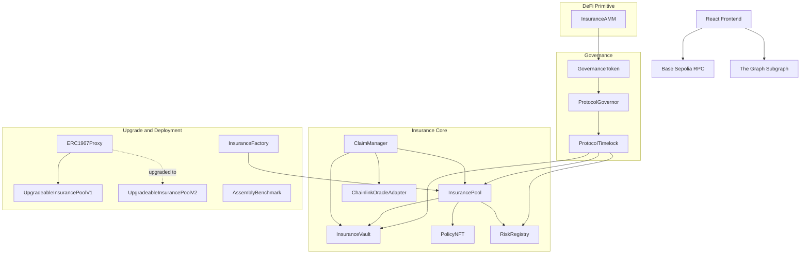
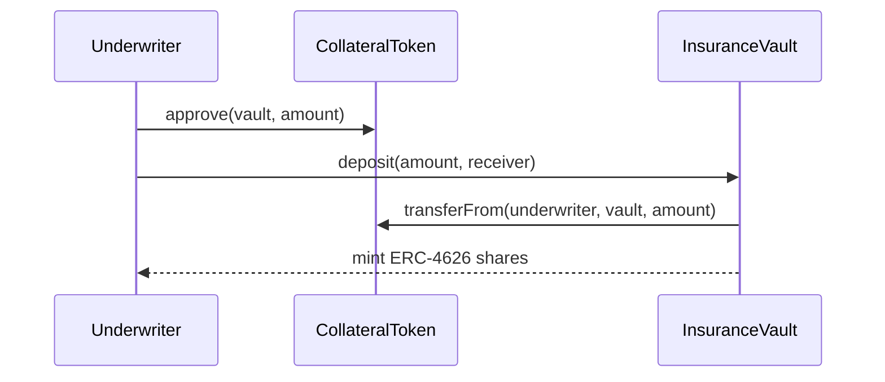
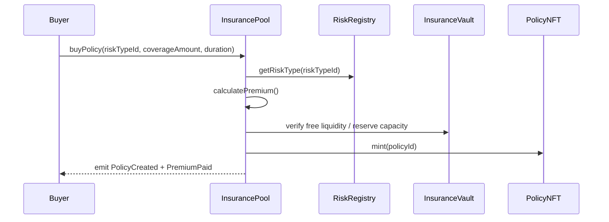
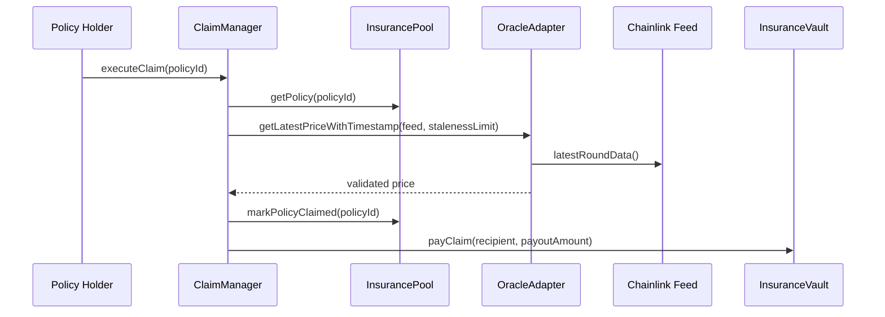
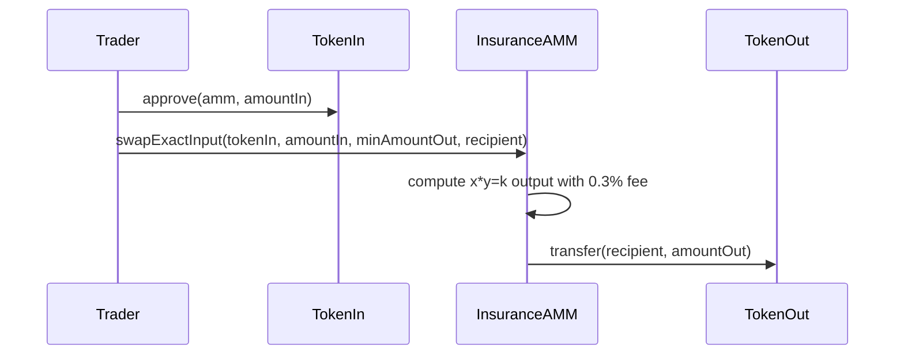
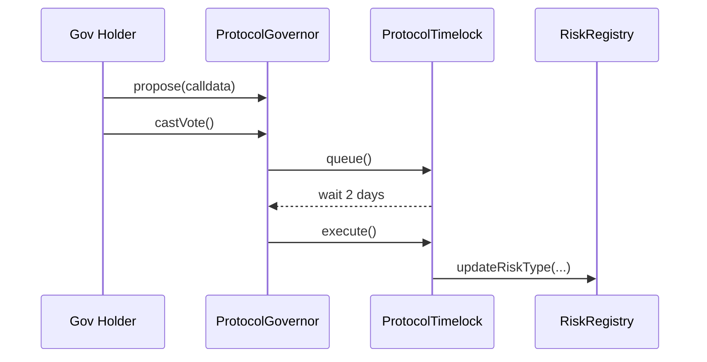

# Architecture Update (Day 4)

## Component Diagram

## Underwriter Deposit Sequence

## Policy Purchase Sequence

## Oracle-Triggered Claim Payout Sequence

## AMM Swap Sequence

## Governance Parameter Update Sequence

## Proxy / UUPS Layout

- `UpgradeableInsurancePoolV1` defines the initial storage layout and `version() -> "v1"`.
- `UpgradeableInsurancePoolV2` appends new state such as `maxPolicyDuration` and returns `version() -> "v2"`.
- `ERC1967Proxy` holds state and delegates logic to the current implementation.
- Upgrade authorization is expected to sit behind `OwnableUpgradeable`, then later behind governance/timelock operations.

## Access-Control Roles

| Contract | Permission Model | Sensitive Actions |
| --- | --- | --- |
| `ProtocolGovernor` | token-weighted voting | propose, vote, queue, execute |
| `ProtocolTimelock` | proposer / executor / admin roles | delayed privileged calls |
| `RiskRegistry` | `AccessControl` | add, update, deactivate risk types |
| `InsuranceVault` | `Ownable` / governed owner | claim payouts, reserve-aware admin hooks |
| `InsurancePool` | `Ownable` / governed owner | claim manager wiring, pause hooks |
| `PolicyNFT` | `Ownable` + pool minter gate | set pool minter, base URI updates |
| `UpgradeableInsurancePoolV1/V2` | `OwnableUpgradeable` | UUPS upgrade authorization |
| `InsuranceFactory` | `Ownable` | CREATE / CREATE2 deployment paths |

## Trust Assumptions

- Chainlink feeds stay live, honest, and semantically correct for each risk type.
- Timelock ownership transfer is completed correctly after deployment.
- Underwriters understand that active coverage restricts free withdrawals.
- Governance token distribution is not so concentrated that DAO control becomes meaningless.
- The frontend and subgraph are convenience layers; protocol correctness still depends on the contracts.

## Design Decisions / ADRs

### ADR-01: Reserve-aware vault accounting

Vault withdrawals must respect active coverage so underwriters cannot drain the pool while protection is still sold.

### ADR-02: Separate claim manager

Claim validation is isolated from policy purchase logic to keep oracle checks and payout flow easier to audit.

### ADR-03: Risk registry instead of hardcoded risk params

Risk types change through governance rather than redeploying the whole pool for each new asset/feed combination.

### ADR-04: Timelock-governed admin path

Privileged parameter updates should move under `ProtocolTimelock` so governance actions have a visible delay.

### ADR-05: UUPS kept minimal

The upgrade demo intentionally adds only one new variable / function in V2 to make storage safety easier to reason about.
