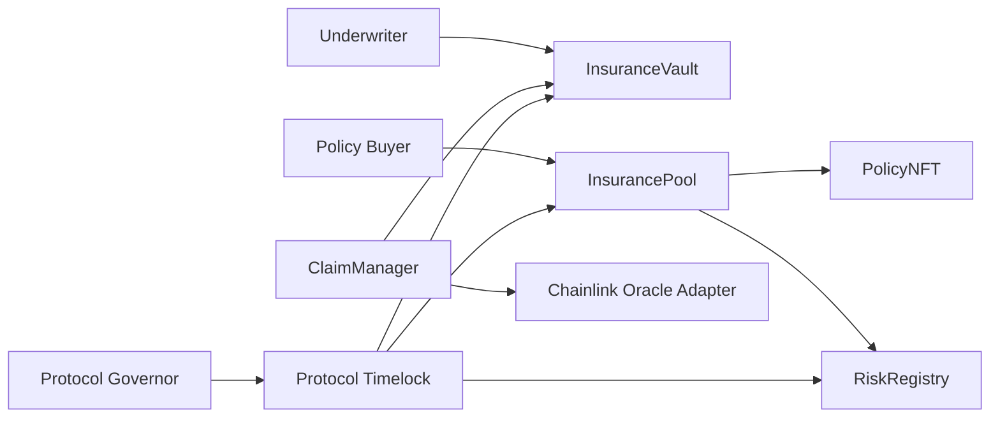

# Architecture

## System Context

## Day 2 Architecture Scope

This document starts the architecture notes for the first real protocol modules delivered after
the repository skeleton:

- `GovernanceToken`
- `PolicyNFT`
- `InsuranceVault`
- `RiskRegistry`

## Early Design Notes

- `GovernanceToken` supplies delegated voting power for later Governor proposals.
- `PolicyNFT` represents ownership of a purchased insurance position.
- `InsuranceVault` holds underwriting collateral and mints ERC4626 vault shares.
- `RiskRegistry` stores governance-controlled risk parameters used by later policy logic.

## Remaining Sections

- component diagram
- contract interaction diagram
- access-control map
- governance and trust assumptions
- claim execution sequence
